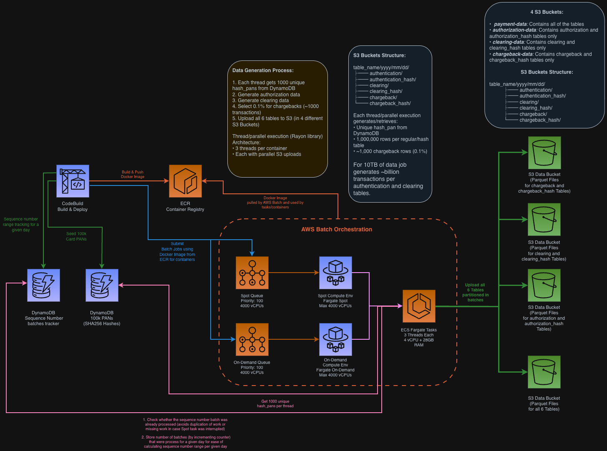

# AWS Batch Transactions Data Generator

## TL;DR

A scalable synthetic payment data generator using AWS Batch and Fargate. Generates realistic transaction data across 3 tables (authorization, clearing, chargeback) with matching 3 hash tables (authorization_hash, clearing_hash, chargeback_hash), partitioned by date in S3. Features deterministic sequence numbering, business logic-driven patterns (real life transaction flow for card transaction processing for authorization -> clearing <-> chargeback), and multi-threaded generation. By default generates **10TB** of data in ~15 minutes. The amount of data needed to be generated is configurable via [`apps/job-deployment-parameters.json`](apps/job-deployment-parameters.json).

## Architecture



## What Gets Generated

- **3 Main Tables**: authorization (84 fields) clearing (118 fields), chargeback (14 fields)
- **3 Hash Tables**: authorization_hash, clearing_hash, chargeback_hash (4 fields each)
- **Data Volume**: 10TB by default (configurable to any size)
- **Partitioning**: `s3://bucket/table_name/yyyy/mm/dd/` format covering 2020-present
- **Transaction Processing Lifecycle**: Shared `hash_pan` and `sequence_number` for a given record enabling transaction joins for a single transaction
- **Realistic Patterns**: 85% purchases, 5% cash advances, 4% balance transfers, etc.

## Quick Start

```bash
# Install dependencies and deploy infrastructure
make setup && make deploy
```

This automatically:
1. Deploys AWS infrastructure (Batch, ECR, S3, VPC, DynamoDB)
2. Seeds DynamoDB with 100k hashed payment card numbers
3. Builds Docker image with Rust data generators
4. Submits batch jobs to generate configured data volume
5. Uploads parquet files to S3 buckets (combined + table-specific)

After data generation completes, you can query the data using Athena. The generated parquet files are automatically partitioned and ready to query. See [`athena-queries/sample_queries.sql`](athena-queries/sample_queries.sql) for example queries.

## Generation Modes

The generator supports two modes via `INITIAL_LOAD` parameter in `apps/job-deployment-parameters.json`:

### 1. Initial Load Mode (`INITIAL_LOAD: true`)
- **Purpose**: Backfill historical data
- **Date Range**: 2020-01-01 to (today - 7 days) inclusive
- **Distribution**: Jobs spread evenly across all dates using deterministic hashing
- **Use Case**: First-time data generation to populate historical partitions
- **Example**: If today is 2024-01-15, generates data from 2020-01-01 to 2024-01-08

### 2. Nightly Mode (`INITIAL_LOAD: false`)
- **Purpose**: Incremental daily data generation
- **Date Range**: (today - 6 days) to today inclusive (covers last 7 days)
- **Distribution**: Jobs focus on recent dates only
- **Use Case**: Daily scheduled runs to generate fresh data
- **Example**: If today is 2024-01-15, generates data from 2024-01-09 to 2024-01-15

## Configuration

Edit `apps/job-deployment-parameters.json`:

```json
{
  "TARGET_TB": 10,           // Total data volume in TB
  "INITIAL_LOAD": true,      // true=historical backfill, false=nightly incremental
  "CARD_BRAND": "VISA",      // VISA, MASTERCARD, AMEX, or DISCOVER
  "NETWORK_BRAND": "VISA",   // Network routing
  "CHARGEBACK_PERCENTAGE": 0.1  // Chargeback rate (0.1 = 0.1%)
}
```

Then re-trigger generation:
```bash
make trigger-generator-job
```

**Tip**: To generate data for recent dates only (from initial_end_date+1 to today), set `INITIAL_LOAD: false` and run `make trigger-generator-job`.

## Architecture

### Deployment Flow

```
CDK Deploy
  ├─ Creates VPC with private subnets + VPC endpoints
  ├─ Creates 5 S3 buckets:
  │   ├─ payment-data (combined storage for every single table)
  │   ├─ clearing-data (clearing-specific)
  │   ├─ authorization-data (authorization-specific)
  │   ├─ chargeback-data (chargeback-specific)
  │   └─ athena-query-results (Athena queries output)
  ├─ Creates 2 DynamoDB tables (hash-pan-table, partition-counter-table)
  ├─ Creates ECR repository
  ├─ Creates AWS Batch compute environments (spot + on-demand)
  ├─ Creates 2 job queues (spot-priority, on-demand-priority)
  ├─ Triggers Lambda to seed DynamoDB with 100k PANs
  └─ Triggers CodeBuild to:
      ├─ Build Rust Docker image
      ├─ Push to ECR
      └─ Submit batch jobs via job-submitter
```

### Data Generation Flow

```
Batch Job Starts
  ├─ Determines partition date (initial or nightly mode)
  ├─ Gets atomic sequence order from DynamoDB
  ├─ Spawns 3 parallel threads
  │
  └─ Each Thread:
      ├─ Fetches unique hash_pan from DynamoDB
      ├─ Generates 250,000 sequential transactions
      ├─ Applies realistic business logic
      ├─ Creates authorization + clearing + chargeback (0.1%)
      ├─ Creates corresponding hash tables
      └─ Uploads 6 parquet files to S3 (combined + specialized buckets)
```

### Key Components

- **AWS Batch**: Orchestrates parallel job execution with 8,000 vCPUs (4k spot + 4k on-demand)
- **Fargate Containers**: Each job runs in isolated container (4 vCPUs, 28GB RAM)
- **Multi-threading**: 3 threads per job for 3x throughput
- **DynamoDB**: Provides unique PANs and atomic sequence coordination
- **S3 Buckets**:
  - `payment-data`: Combined storage for all tables
  - `clearing-data`: Clearing-specific data
  - `authorization-data`: Authorization-specific data
  - `chargeback-data`: Chargeback-specific data
  - `athena-query-results`: Athena query output
- **VPC Endpoints**: Private connectivity (S3, ECR, DynamoDB, CloudWatch)

## Data Structure

### Sequence Numbers
- **Per-partition coordination**: DynamoDB atomic counters ensure no gaps/overlaps
- **Base sequence**: Each date partition starts at `1000000000000001`
- **Per-job allocation**: 1,500,000 sequential numbers (3 threads × 500,000 each)
- **Example**: On 2024-01-15:
  - Job order 0: 1000000000000001-1000000001500000
  - Job order 1: 1000000001500001-1000000003000000
  - Job order 2: 1000000003000001-1000000004500000
  - Job order 3: 1000000004500001-1000000006000000
  - Next day (2024-01-16) resets to 1000000000000001

### Table Relationships
All tables within a thread share:
- `hash_pan` - Unique hashed PAN from DynamoDB
- `sequence_number` - Sequential transaction ID
- `process_date` - Matches S3 partition date
- `insert_date` - 1-3 days after process_date (realistic settlement delay)

### Schema Details
- **authorization**: 84 fields (transaction auth data)
- **clearing**: 122 fields (settlement data)
- **chargeback**: 14 fields (dispute data, 0.1% of auth transactions)
- **hash tables**: 4 fields each (hash_pan, sequence_number, process_date, insert_date)

## Business Logic

### Transaction Distribution
- 85% PURCHASE
- 5% CASH_ADVANCE
- 4% BALANCE_TRANSFER
- 3% REFUND
- 2% ATM_WITHDRAWAL
- 1% Other types

### Card Products
- **Visa**: Chase Sapphire Preferred (CSP), Chase Sapphire Reserve (CSR), Chase Freedom Unlimited (CFU)
- **Mastercard**: Chase Freedom Flex (CFX), World of Hyatt (WOH), Chase Business (BUS)
- **Amex**: Platinum (PLT), Gold (GLD), Green (GRN)
- **Discover**: Standard Discover cards

### Realistic Features
- Transaction-specific auth response codes
- Amount-based risk scoring
- MTI codes aligned with transaction flow
- Settlement status based on transaction type
- Geographic patterns with country codes

## Project Structure

```
.
├── lib/
│   └── batch-data-generator-stack.ts    # CDK infrastructure
├── apps/
│   ├── data-generator/                  # Rust data generator (3 threads/job)
│   │   ├── src/main.rs                  # Multi-threaded orchestration
│   │   ├── src/data_generator.rs        # Table generation logic
│   │   ├── src/common.rs                # Business logic & distributions
│   │   ├── src/dynamodb_client.rs       # DynamoDB coordination
│   │   └── Dockerfile                   # Container definition
│   ├── job-submitter/                   # Rust job submission tool
│   ├── dynamodb-seeder/                 # Lambda PAN seeder
│   └── job-deployment-parameters.json   # Generation config
├── athena-queries/
│   └── sample_queries.sql               # Sample analysis queries
└── Makefile                             # Deployment commands
```

## Querying Data

Query results are automatically stored in the `athena-query-results` S3 bucket created during deployment.

Example query from `athena-queries/sample_queries.sql`:
```sql
SELECT
    DATE(process_date) as date,
    COUNT(*) as transactions,
    SUM(transaction_amount_cents)/100.0 as total_amount
FROM payment_data.authorization
WHERE year = '2024' AND month = '01'
GROUP BY DATE(process_date)
ORDER BY date;
```

## Monitoring

- **AWS Batch Console**: Job queue status and execution progress
- **CloudWatch Logs**: Individual job logs at `/aws/batch/job`
- **S3 Console**: Generated parquet files organized by `table/year/month/day`
- **DynamoDB Console**: Hash PAN table and partition counters

## Cost Estimate

For **10TB generation** (default):
- **Runtime**: ~10 minutes with 8,000 vCPUs
- **Compute**: ~$50-75 (Fargate spot + on-demand)
- **Storage**: ~$230/month for 10TB S3 Standard
- **DynamoDB**: ~$1 (100k items + counters)
- **VPC Endpoints**: ~$0.50 (hourly rate)
- **Total**: ~$60-80 for generation + $230/month storage

## Clean Up

```bash
# Destroy all AWS resources (keeps data buckets)
make destroy

# Also delete all data buckets
make destroy-data-buckets
```

**Note**: S3 buckets with generated data have `RemovalPolicy.RETAIN` to prevent accidental data loss. Use `make destroy-data-buckets` to explicitly delete them.

## Key Features

- ✅ **Sequential Numbering**: Atomic DynamoDB coordination ensures no gaps
- ✅ **Multi-threaded**: 3 threads per job = 3x throughput
- ✅ **Dual Upload**: Data stored in combined + specialized buckets
- ✅ **Realistic Data**: Business logic based on actual payment processing
- ✅ **Flexible Scaling**: Configure any data volume via `TARGET_TB`
- ✅ **Two Generation Modes**: Initial load (historical) + nightly (incremental)
- ✅ **Spot-friendly**: Deterministic partitioning with retry handling
- ✅ **Private Network**: All traffic via VPC endpoints
- ✅ **Snappy Compression**: Parquet files compressed for optimal storage
- ✅ **Automatic Deployment**: One-command infrastructure + data generation

## Additional Documentation

- `BATCH_WORKFLOW.md`: Detailed deployment and execution flow
- `architecture/`: System architecture diagrams
- `athena-queries/sample_queries.sql`: Sample SQL queries for data analysis
